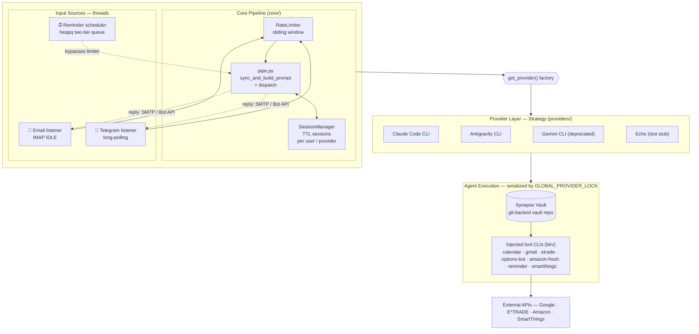

# Synapse Engine

The ingestion and dispatch layer for the **Synapse** system. Synapse Engine
bridges external communication channels (Email, Telegram) with a pluggable AI
backend — capturing messages, standardizing them into a structured format, and
routing them to the configured AI provider for autonomous processing of the
**Synapse Vault**.

> **Supported providers:** Claude Code CLI, Antigravity CLI (agy), Gemini CLI (deprecated — replaced by agy)
>
> **Vault template:** [synapse-vault](https://github.com/kristianolsson/synapse-vault) — a generic, public starter vault (protocols only, no personal data) to pair with this engine.
>
> **Learn more:** [synapse](https://kristianolsson.github.io/synapse/) — a plain-language overview of what this system actually does.
>
> **Working in this repo:** [`docs/ARCHITECTURE.md`](docs/ARCHITECTURE.md) — deeper technical reference (state model, the E\*TRADE retry mechanism, known rough edges). [`CLAUDE.md`](CLAUDE.md) — working guidance for AI sessions making changes here.


## How It Works

1. **Listen** — Monitors incoming messages via IMAP IDLE (Email) and long-polling (Telegram), plus a built-in scheduler that fires recurring and one-shot reminders.
2. **Standardize** — Wraps content in a YAML metadata block (`Type`, `Sender`, `Context`, `Current Time`, and Vault git-sync status).
3. **Dispatch** — Sends the formatted prompt to the configured AI provider.
4. **Respond**
   - **Email:** Silent on success. Replies only on error or clarification.
   - **Telegram:** Always replies with a concise confirmation or response.

## Architecture



**Flow:** each input source normalizes its message into an `IncomingMessage`, `pipe.py` wraps it in a YAML metadata block (and syncs the Vault via `git pull`), then dispatches to the provider chosen by the `get_provider()` factory. The provider shells out to an AI CLI running inside the Vault — where the injected tool CLIs on `PATH` let the agent act on Calendar, Gmail, brokerage, and groceries. A single `GLOBAL_PROVIDER_LOCK` serializes all agent/git activity so concurrent channels never race the shared Vault.

## Modules

The service is organized into the following layers under `services/ingestion/`:

| Layer | Path | Responsibility |
|---|---|---|
| **Entry Point** | `main.py` | Starts enabled channels + the reminder scheduler in daemon threads, sharing one `RateLimiter` and `SessionManager` across all of them |
| **Config** | `config.py` | Env-driven configuration, provider selection and fallback rotation |
| **Channels** | `channels/email/` | IMAP IDLE listener + SMTP reply |
| | `channels/telegram/` | Long-polling bot: listener, standalone sender, shared reply-delivery helpers (HTML-fallback sending, Actionable-Form/task keyboards) |
| **Core** | `core/pipe.py` | Prompt standardization + Vault git sync + provider dispatch |
| | `core/scheduler.py` | Reminder scheduler (heapq two-tier queue; recurring + one-shot) |
| | `core/session_manager.py` | Per-user/provider session state (TTL + midnight reset) |
| | `core/rate_limiter.py` | Shared sliding-window rate limiter |
| **Providers** | `providers/` | Pluggable AI backends via `AIProvider` ABC + factory (`claude`, `agy`, `gemini` (deprecated), `echo`) |
| **Tools** | `tools/calendar_cli.py` | Google Calendar CLI (list, create events) |
| _(injected onto the_ | `tools/gmail_cli.py` | Gmail CLI (inbox, labels, drafts) |
| _agent's `PATH`_ | `tools/reminder_cli.py` | Reminder CRUD backing the scheduler |
| _via `bin/`)_ | `tools/etrade_cli.py` + `tools/stocks/` | E\*TRADE quotes, options, and positions (Playwright auth; falls back to a manual PIN-auth flow over Telegram/email when automated login is blocked — see [`docs/ARCHITECTURE.md`](docs/ARCHITECTURE.md)) |
| | `tools/options_bot_cli.py` | Weekday options-opportunity scan → HTML report |
| | `tools/amazon_fresh_cli.py` + `tools/amazon_fresh/` | Amazon Fresh grocery browsing (Playwright) |
| | `tools/smartthings_cli.py` + `tools/smartthings/` | SmartThings device list/status/control (OAuth2, rate-limit backoff, TTL-cached device-name resolution) |
| **Setup-only** | `tools/setup_google.py` | One-time OAuth2 setup for Calendar + Gmail — run manually, not agent-facing |
| **Utils** | `utils/stats_formatter.py` | Per-channel token/cost/usage stats formatting |
| | `utils/task_formatter.py` | Two-way task-completion parsing and formatting |
| | `utils/html_utils.py` | Telegram HTML sanitization |


## Telegram Commands

When interacting with the bot via Telegram, the following commands are available:

- `/new` | `/clear` — Clears the current session and starts a fresh context.
- `/stats on` | `/stats off` — Toggles the display of token usage and request stats after responses.
- `/update` — Pulls the latest code via git and gracefully restarts the service.
- `/update-cli` — Locally updates the Claude and Gemini CLI tools via npm (useful for getting the latest CLI versions without rebuilding the container).
- `/update-claude-auth` — Re-authenticates the Claude CLI: replies with an OAuth URL, then completes login once you reply with the code (see [Token refresh](qnap-setup.md#token-refresh) in `qnap-setup.md`).
- `/update-smartthings-auth` — Re-authenticates SmartThings the same way: replies with an authorization URL, then exchanges and saves the token once you reply with the code — no SSH/scp needed (see [Token refresh](qnap-setup.md#token-refresh)).
- `/provider <claude|agy|gemini>` — Switches the active AI provider (`gemini` deprecated — replaced by agy). Without an argument, shows the current provider.
- `/amazon heal` — Re-bootstraps the Amazon Fresh CSS selectors from the live pages when the scraper breaks.
- `/help` — Shows the available Telegram commands.

## Setup

1.  **Prerequisites:**
    -   Python 3.10+
    -   At least one AI CLI installed: [Claude Code CLI](https://docs.anthropic.com/en/docs/claude-code), [Antigravity CLI (agy)](https://antigravity.google/cli/install.sh), or [Gemini CLI](https://github.com/google-gemini/gemini-cli) (deprecated — replaced by agy).
    -   A dedicated Gmail account for ingestion (with App Password).
    -   (Recommended) A Telegram bot token from [@BotFather](https://t.me/BotFather).

    **Install dependencies** (needed for the Google API Setup commands
    below, and for E\*TRADE/Amazon Fresh/SmartThings if you use those):
    ```bash
    python3 -m venv venv
    source venv/bin/activate
    pip install -r requirements.txt
    ```

2.  **Configure:**
    Copy `.env.example` to `.env` and fill in your credentials:
    ```bash
    cp .env.example .env
    nano .env
    ```

    **Key Configuration** (see `.env.example` for the full list, including CLI paths, timeouts, cost budgets, and E\*TRADE options):
    - `ENABLED_CHANNELS`: Comma-separated list of channels to run (`email`, `telegram`, or `email,telegram`).
    - `AI_PROVIDERS`: Ordered, comma-separated provider list — the first is the default, the rest are fallbacks on quota errors (e.g. `claude,agy`). Valid values: `claude`, `agy`, `gemini` (deprecated — replaced by agy), `echo`.
    - `EMAIL_ADDRESS`: The account to ingest from (and reply from).
    - `ALLOWED_SENDERS`: Whitelist of email addresses authorized to send tasks.
    - `REPLY_TO_ADDRESS`: (Optional) Redirect all system replies to this address.
    - `TELEGRAM_BOT_TOKEN`: Bot token from @BotFather.
    - `TELEGRAM_ALLOWED_USER_IDS`: Comma-separated Telegram user IDs authorized to interact with the bot.

    **Telegram Setup:**
    1. Message [@BotFather](https://t.me/BotFather) on Telegram and create a bot (`/newbot`).
    2. Copy the token to `TELEGRAM_BOT_TOKEN` in `.env`.
    3. Get your Telegram user ID (message [@userinfobot](https://t.me/userinfobot)) and add it to `TELEGRAM_ALLOWED_USER_IDS`.
    4. Set `ENABLED_CHANNELS=email,telegram` (or `telegram` for Telegram only).

    **Google API Setup (Calendar + Gmail):**

    Calendar and Gmail share a single OAuth2 credential and token. You only authenticate once.

    1. Create a project in [Google Cloud Console](https://console.cloud.google.com/).
    2. Enable both the **Google Calendar API** and the **Gmail API**.
    3. Create an OAuth 2.0 Client ID (type: Desktop app), download the JSON as `credentials.json` into the project root.
    4. Add your email as a test user under **OAuth consent screen → Test users**.
    5. Run the setup script (opens a browser to grant Calendar + Gmail scopes at once):
       ```bash
       python -m services.ingestion.tools.setup_google
       ```
    6. Copy `calendars.json.example` to `calendars.json` and fill in your calendar IDs from the setup output:
       ```bash
       cp calendars.json.example calendars.json
       ```
    7. Test both CLIs:
       ```bash
       python -m services.ingestion.tools.calendar_cli list-events --days 7
       python -m services.ingestion.tools.gmail_cli list-inbox --limit 5
       ```
    8. Both integrations are automatically injected as global `calendar` and `gmail` commands to AI providers — no additional configuration needed.

    **SmartThings API Setup (Optional):**

    Registration happens through the separate **SmartThings CLI** (an npm
    tool, not this repo's own `smartthings` command) — its command names
    have shifted between versions, so if a step below doesn't match what
    you see, run `smartthings help` / `smartthings apps --help` to find
    the current equivalent.

    1. Install and log in:
       ```bash
       npm install -g @smartthings/cli
       smartthings apps
       ```
       There's no explicit `login` command — the first command that needs
       auth opens a browser for you automatically.
    2. Register an app: `smartthings apps:create`, choosing **"OAuth-In
       App"** (not "Webhook SmartApp"/Automation — a different,
       incompatible flow). At the prompts:
       - Scopes: **`r:devices:*` and `x:devices:*` only** — don't select
         `w:devices:*`, this integration never edits device config.
       - Redirect URI: `https://httpbin.org/get`. SmartThings requires
         HTTPS and rejects `http://localhost` with 403 — httpbin is a
         public page that just echoes the code back to you to copy, which
         is what `smartthings auth` below expects by default.
    3. Copy the `clientId`/`clientSecret` the CLI prints at the end — SmartThings only shows them once.
    4. Add them to `.env`:
       ```
       SMARTTHINGS_CLIENT_ID=<clientId>
       SMARTTHINGS_CLIENT_SECRET=<clientSecret>
       ```
    5. Run this repo's own auth flow (opens a browser, then prompts you to paste back the code httpbin displays):
       ```bash
       python -m services.ingestion.tools.smartthings_cli auth
       ```
    6. Test it:
       ```bash
       python -m services.ingestion.tools.smartthings_cli list-devices
       ```
    7. Automatically injected as a global `smartthings` command to AI providers, same as the others — no additional configuration needed.

3.  **Install & run:** installation is deployment-specific — jump to [Deployment](#deployment) below and follow whichever fits:
    - **Option A — macOS (`launchd`)**: runs directly on your Mac in a local Python venv.
    - **Option B — Docker / QNAP NAS**: runs in a container with everything bundled — no local venv needed to run the service itself. If you use Calendar/Gmail, E\*TRADE, Amazon Fresh, or SmartThings, though, you'll still need a local checkout + venv somewhere to bootstrap those credentials once — see [`qnap-setup.md`](qnap-setup.md)'s Prerequisites.

## Deployment

There are two supported ways to run Synapse Engine as a long-lived service.

### Option A — macOS (`launchd`)

Best for running on a personal Mac. Runs the service in the background via a `launchd` agent.

1.  **Dependencies already installed?** If you haven't done the "Install
    dependencies" step under [Setup](#setup) yet, do that first — same
    `venv`/`pip install -r requirements.txt` commands either way.

2.  **Set up and start:**
    ```bash
    ./synapse.sh setup
    ```
    This auto-detects your paths, generates the plist from
    `com.synapse.ingestion.plist.template`, installs it as a `launchd`
    agent, and starts the service. If `VAULT_PATH` isn't set in `.env` yet,
    it also offers to clone the public
    [synapse-vault](https://github.com/kristianolsson/synapse-vault)
    template and detach it into your own independent local git repo before
    continuing — see [Vault setup](#vault-setup) below.

3.  **Day-to-day commands:**
    ```bash
    ./synapse.sh start            # start the service
    ./synapse.sh stop             # stop it (until next login/reboot)
    ./synapse.sh stop --persist   # stop it and disable auto-start
    ./synapse.sh restart          # restart
    ./synapse.sh update           # git pull, then restart
    ./synapse.sh logs             # tail the log files
    ```

4.  **Logs:**
    ```bash
    tail -f /tmp/synapse-ingestion.out.log
    tail -f /tmp/synapse-ingestion.err.log
    ```
    (equivalent to `./synapse.sh logs`)

### Option B — Docker / QNAP NAS

Best for always-on, headless operation. The `Dockerfile` bundles the Claude,
Antigravity, and Gemini (deprecated) CLIs plus a Playwright Firefox (for
E\*TRADE and Amazon Fresh browser auth), and `docker-compose.yml` mounts the
Vault, CLI credentials, and SSH key from persistent storage.

```bash
./synapse.sh setup
```
If no vault exists yet at the host's expected vault path, this first offers
to clone the public
[synapse-vault](https://github.com/kristianolsson/synapse-vault) template
there and detach it into an independent local git repo — see
[Vault setup](#vault-setup) below — then it builds the image and starts the
containers via `docker compose`.

```bash
./synapse.sh start     # start (equivalent to docker compose up -d)
./synapse.sh stop      # stop (docker compose down)
./synapse.sh restart   # docker compose restart
./synapse.sh update    # git pull; rebuild + restart only if anything changed (rebuild only if Dockerfile/requirements.txt did)
./synapse.sh logs      # docker compose logs -f
```

The compose file expects an `.env` and mounted credential directories on the
host. For a full walkthrough on a QNAP NAS (creating the `synapse` user,
folder layout, seeding Claude/Antigravity/Gemini/E\*TRADE/Amazon credentials,
and the OAuth token), see **[`qnap-setup.md`](qnap-setup.md)**.

**Updating:** for code-only changes, send `/update` via Telegram (git pull +
graceful restart — the container's `restart: always` brings it back). For
`Dockerfile`/`requirements.txt` changes, SSH in and run `./synapse.sh update`
instead — it pulls, rebuilds automatically only when those files changed,
and restarts (a no-op pull leaves the service running as-is).

## Vault setup

Both `./synapse.sh setup` paths above check for a configured vault (`VAULT_PATH`
on Mac, a `vault/` directory under the host dir on QNAP) and, if none is
found, offer to clone the public
[synapse-vault](https://github.com/kristianolsson/synapse-vault) template —
a generic, personal-data-free starter vault — and detach it into your own
independent local git repo (its own git history, no ties back to the
template) before continuing setup. You can decline and use an existing vault
instead: on Mac, just point `VAULT_PATH` at it directly (Mac has git, so
there's nothing to script). On QNAP, `VAULT_PATH` is fixed by
`docker-compose.yml`'s bind mount, so either place an existing vault repo at
`$SYNAPSE_HOST_DIR/vault` yourself before running `./synapse.sh setup` (it'll
be detected and the offer skipped), or decline the template prompt and give
`./synapse.sh setup` your vault's git URL instead — QNAP has no host git, so it
clones it for you inside the same throwaway container it uses for the
template, as-is (history and remote intact, no detach).

## Development

**Run Tests:**
```bash
python -m pytest services/ -v
```

The `./synapse.sh` dispatcher and its shared helpers have their own bash test
suites under `scripts/tests/` (plain bash assertions, no framework). Each is
runnable directly:
```bash
bash scripts/tests/test_synapse_common.sh   # env-file + detection helpers
bash scripts/tests/test_synapse_mac.sh      # launchd plist generation
bash scripts/tests/test_synapse_qnap.sh     # host-dir resolution, rebuild trigger
bash scripts/tests/test_vault_setup.sh      # vault clone/detach flow
```

**Manual Run:**
```bash
python -m services.ingestion.main
```

