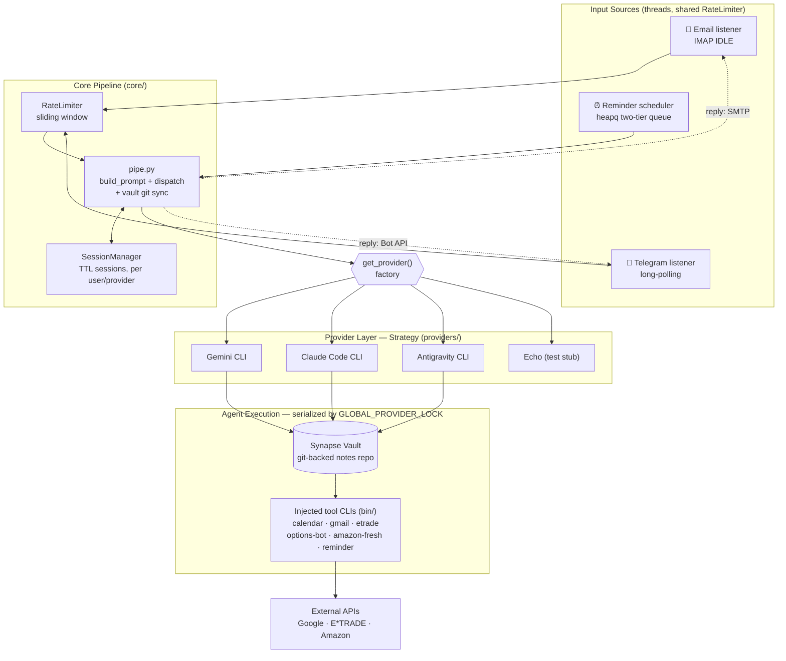

# Synapse Engine

The ingestion and dispatch layer for the **Synapse** system. Synapse Engine
bridges external communication channels (Email, Telegram) with a pluggable AI
backend — capturing messages, standardizing them into a structured format, and
routing them to the configured AI provider for autonomous processing of the
**Synapse Vault**.

> **Supported providers:** Gemini CLI, Claude Code CLI, Antigravity CLI (agy)

## How It Works

1. **Listen** — Monitors incoming messages via IMAP IDLE (Email) and long-polling (Telegram).
2. **Standardize** — Wraps content in a YAML metadata block (`Type`, `Sender`, `Context`).
3. **Dispatch** — Sends the formatted prompt to the configured AI provider.
4. **Respond**
   - **Email:** Silent on success. Replies only on error or clarification.
   - **Telegram:** Always replies with a concise confirmation or response.

## Architecture



**Flow:** each input source normalizes its message into an `IncomingMessage`, `pipe.py` wraps it in a YAML metadata block (and syncs the Vault via `git pull`), then dispatches to the provider chosen by the `get_provider()` factory. The provider shells out to an AI CLI running inside the Vault — where the injected tool CLIs on `PATH` let the agent act on Calendar, Gmail, brokerage, and groceries. A single `GLOBAL_PROVIDER_LOCK` serializes all agent/git activity so concurrent channels never race the shared Vault.

## Modules

The service is organized into four layers under `services/ingestion/`:

| Layer | Path | Responsibility |
|---|---|---|
| **Entry Point** | `main.py` | Starts enabled channels in threads |
| **Config** | `config.py` | Loads environment variables |
| **Channels** | `channels/email/` | IMAP IDLE listener + SMTP reply |
| | `channels/telegram/` | Telegram bot long-polling |
| **Core** | `core/pipe.py` | Prompt formatting + AI provider dispatch |
| | `core/rate_limiter.py` | Sliding-window rate limiter |
| | `core/session_manager.py` | Per-user session state (TTL-based) |
| **Providers** | `providers/` | Pluggable AI backends (`gemini`, `claude`, `echo`) |
| **Tools** | `tools/calendar_cli.py` | Google Calendar CLI (list, create events) |
| | `tools/gmail_cli.py` | Gmail CLI (inbox, labels, drafts) |
| | `tools/setup_google.py` | One-time OAuth2 setup for Calendar + Gmail |
| **Utils** | `utils/stats_formatter.py` | Channel-specific stats formatters |


## Setup

1.  **Prerequisites:**
    -   Python 3.10+
    -   At least one AI CLI installed: [Gemini CLI](https://github.com/google-gemini/gemini-cli), [Claude Code CLI](https://docs.anthropic.com/en/docs/claude-code), or [Antigravity CLI (agy)](https://antigravity.google/cli/install.sh).
    -   A dedicated Gmail account for ingestion (with App Password).
    -   (Recommended) A Telegram bot token from [@BotFather](https://t.me/BotFather).

2.  **Install:**
    ```bash
    python3 -m venv venv
    source venv/bin/activate
    pip install -r requirements.txt
    ```

3.  **Configure:**
    Copy `.env.example` to `.env` and fill in your credentials:
    ```bash
    cp .env.example .env
    nano .env
    ```

    **Key Configuration:**
    - `ENABLED_CHANNELS`: Comma-separated list of channels to run (`email`, `telegram`, or `email,telegram`).
    - `AI_PROVIDER`: The AI backend to use (`gemini`, `claude`, `agy`, or `echo`). Defaults to `gemini`.
    - `CLAUDE_CMD`: (Optional) Explicit path to `claude` binary. Auto-detected if omitted.
    - `CLAUDE_TIMEOUT_SECONDS`: Max execution time for Claude CLI (default: `300`).
    - `CLAUDE_MAX_BUDGET_USD`: (Optional) Per-request cost cap for Claude.
    - `AGY_CMD`: (Optional) Explicit path to `agy` binary. Auto-detected if omitted.
    - `AGY_TIMEOUT_SECONDS`: Max execution time for Antigravity CLI (default: `300`).
    - `EMAIL_ADDRESS`: The account to ingest from (and reply from).
    - `ALLOWED_SENDERS`: Whitelist of email addresses authorized to send tasks.
    - `REPLY_TO_ADDRESS`: (Optional) Redirect all system replies to this address.
    - `TELEGRAM_BOT_TOKEN`: Bot token from @BotFather.
    - `TELEGRAM_ALLOWED_USER_IDS`: Comma-separated Telegram user IDs authorized to interact with the bot.

    **Telegram Setup:**
    1. Message [@BotFather](https://t.me/BotFather) on Telegram and create a bot (`/newbot`).
    2. Copy the token to `TELEGRAM_BOT_TOKEN` in `.env`.
    3. Get your Telegram user ID (message [@userinfobot](https://t.me/userinfobot)) and add it to `TELEGRAM_ALLOWED_USER_IDS`.
    4. Set `ENABLED_CHANNELS=email,telegram` (or `telegram` for Telegram only).

    **Google API Setup (Calendar + Gmail):**

    Calendar and Gmail share a single OAuth2 credential and token. You only authenticate once.

    1. Create a project in [Google Cloud Console](https://console.cloud.google.com/).
    2. Enable both the **Google Calendar API** and the **Gmail API**.
    3. Create an OAuth 2.0 Client ID (type: Desktop app), download the JSON as `credentials.json` into the project root.
    4. Add your email as a test user under **OAuth consent screen → Test users**.
    5. Run the setup script (opens a browser to grant Calendar + Gmail scopes at once):
       ```bash
       python -m services.ingestion.tools.setup_google
       ```
    6. Copy `calendars.json.example` to `calendars.json` and fill in your calendar IDs from the setup output:
       ```bash
       cp calendars.json.example calendars.json
       ```
    7. Test both CLIs:
       ```bash
       python -m services.ingestion.tools.calendar_cli list-events --days 7
       python -m services.ingestion.tools.gmail_cli list-inbox --limit 5
       ```
    8. Both integrations are automatically injected as global `calendar` and `gmail` commands to AI providers — no additional configuration needed.

## Telegram Commands

When interacting with the bot via Telegram, the following commands are available:

- `/new` — Clears the current session and starts a fresh context.
- `/stats on` | `/stats off` — Toggles the display of token usage and request stats after responses.
- `/update` — Pulls the latest code via git and gracefully restarts the service.
- `/update-cli` — Locally updates the Claude and Gemini CLI tools via npm (useful for getting the latest CLI versions without rebuilding the container).
- `/provider <gemini|claude>` — Switches the active AI provider. Without an argument, shows the current provider.
- `/help` — Shows the available Telegram commands.

## Deployment (macOS)

Run as a background service using `launchd`.

1.  **Install & Start:**
    ```bash
    ./install.sh
    ```
    This auto-detects your paths, generates the plist, and installs the service.

2.  **Logs:**
    ```bash
    tail -f /tmp/synapse-ingestion.out.log
    tail -f /tmp/synapse-ingestion.err.log
    ```

## Development

**Run Tests:**
```bash
python -m pytest services/ -v
```

**Manual Run:**
```bash
python -m services.ingestion.main
```

