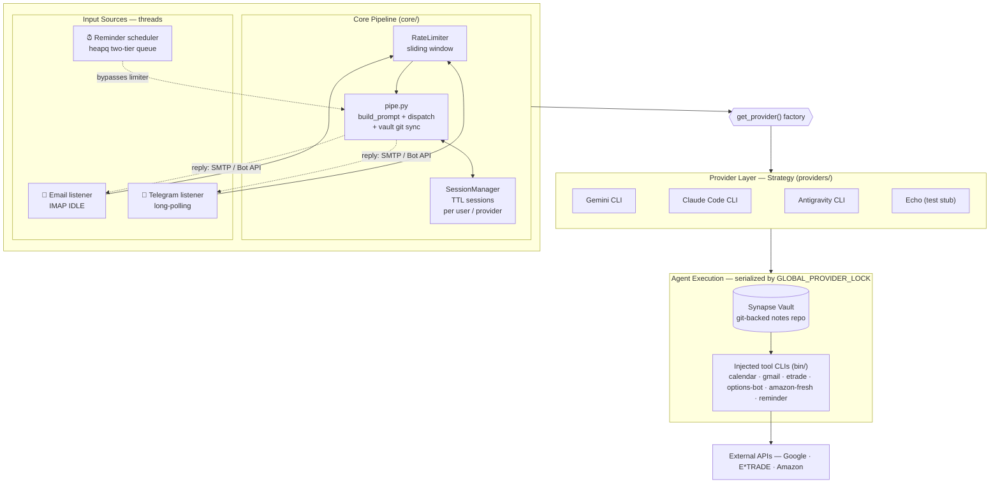

# Synapse Engine

The ingestion and dispatch layer for the **Synapse** system. Synapse Engine
bridges external communication channels (Email, Telegram) with a pluggable AI
backend — capturing messages, standardizing them into a structured format, and
routing them to the configured AI provider for autonomous processing of the
**Synapse Vault**.

> **Supported providers:** Gemini CLI, Claude Code CLI, Antigravity CLI (agy)

## How It Works

1. **Listen** — Monitors incoming messages via IMAP IDLE (Email) and long-polling (Telegram), plus a built-in scheduler that fires recurring and one-shot reminders.
2. **Standardize** — Wraps content in a YAML metadata block (`Type`, `Sender`, `Context`, `Current Time`, and Vault git-sync status).
3. **Dispatch** — Sends the formatted prompt to the configured AI provider.
4. **Respond**
   - **Email:** Silent on success. Replies only on error or clarification.
   - **Telegram:** Always replies with a concise confirmation or response.

## Architecture



**Flow:** each input source normalizes its message into an `IncomingMessage`, `pipe.py` wraps it in a YAML metadata block (and syncs the Vault via `git pull`), then dispatches to the provider chosen by the `get_provider()` factory. The provider shells out to an AI CLI running inside the Vault — where the injected tool CLIs on `PATH` let the agent act on Calendar, Gmail, brokerage, and groceries. A single `GLOBAL_PROVIDER_LOCK` serializes all agent/git activity so concurrent channels never race the shared Vault.

## Modules

The service is organized into the following layers under `services/ingestion/`:

| Layer | Path | Responsibility |
|---|---|---|
| **Entry Point** | `main.py` | Starts enabled services + the reminder scheduler in daemon threads |
| **Config** | `config.py` | Env-driven configuration, provider selection and fallback rotation |
| **Services** | `services/email/` | IMAP IDLE listener + SMTP reply (channel) |
| | `services/telegram/` | Long-polling bot: listener, sender, inline buttons (channel) |
| | `services/calendar/` | Google Calendar CLI + MCP (tool) |
| | `services/gmail/` | Gmail CLI (tool) |
| | `services/reminder/` | Reminder CLI + scheduler (tool) |
| | `services/etrade/` | E*TRADE CLI + `stocks/` (tool) |
| | `services/options_bot/` | Weekday options scan (tool, depends on etrade) |
| | `services/amazon_fresh/` | Amazon Fresh CLI + `internal/` (tool) |
| **Core** | `core/pipe.py` | Prompt standardization + Vault git sync + provider dispatch |
| | `core/session_manager.py` | Per-user/provider session state (TTL + midnight reset) |
| | `core/rate_limiter.py` | Shared sliding-window rate limiter |
| **Providers** | `providers/` | Pluggable AI backends via `AIProvider` ABC + factory (`gemini`, `claude`, `agy`, `echo`) |
| **Registry** | `registry.py` | Discovers `services/*/manifest.json`, validates `ENABLED_SERVICES` |
| **Vault Sync** | `vault_sync.py` | `apply()` — syncs service `PROTOCOL.md` into the vault on every boot |
| **Utils** | `utils/stats_formatter.py` | Per-channel token/cost/usage stats formatting |
| | `utils/task_formatter.py` | Two-way task-completion parsing and formatting |
| | `utils/html_utils.py` | Telegram HTML sanitization |


## Setup

1.  **Prerequisites:**
    -   Python 3.10+
    -   At least one AI CLI installed: [Gemini CLI](https://github.com/google-gemini/gemini-cli), [Claude Code CLI](https://docs.anthropic.com/en/docs/claude-code), or [Antigravity CLI (agy)](https://antigravity.google/cli/install.sh).
    -   A dedicated Gmail account for ingestion (with App Password).
    -   (Recommended) A Telegram bot token from [@BotFather](https://t.me/BotFather).

2.  **Install:**
    ```bash
    python3 -m venv venv
    source venv/bin/activate
    pip install -r requirements.txt
    ```

3.  **Configure:**
    Copy `.env.example` to `.env` and fill in your credentials:
    ```bash
    cp .env.example .env
    nano .env
    ```

    If you don't already have a notes vault, clear `VAULT_PATH` (the example file ships a placeholder) and leave it unset or blank — `./synapse setup` will then offer to scaffold a fresh one for you: it writes `VAULT_PATH` into `.env` as soon as the vault (defaults to a nested `vault/` folder in the project) is created, then initializes it as its own git repo and optionally wires up a git remote.

    **Key Configuration** (see `.env.example` for the full list, including model, timeout, retry, and E\*TRADE options):
    - `VAULT_PATH`: Absolute path to your Obsidian/markdown vault. Leave unset to have `./synapse setup` scaffold one (see above).
    - `ENABLED_SERVICES`: Comma-separated list of services to run — channels (`email`, `telegram`, at least one required) plus tools (`calendar`, `gmail`, `reminder`, `etrade`, `options-bot`, `amazon-fresh`). Run `./synapse services` to see all available services and their current status.
    - `AI_PROVIDERS`: Ordered, comma-separated provider list — the first is the default, the rest are fallbacks on quota errors (e.g. `claude,gemini`). Valid values: `gemini`, `claude`, `agy`, `echo`.
    - `AI_PROVIDER`: Legacy single-provider variable (still honored if `AI_PROVIDERS` is unset). Defaults to `gemini`.
    - `CLAUDE_CMD`: (Optional) Explicit path to `claude` binary. Auto-detected if omitted.
    - `CLAUDE_TIMEOUT_SECONDS`: Max execution time for Claude CLI (default: `300`).
    - `CLAUDE_MAX_BUDGET_USD`: (Optional) Per-request cost cap for Claude.
    - `AGY_CMD`: (Optional) Explicit path to `agy` binary. Auto-detected if omitted.
    - `AGY_TIMEOUT_SECONDS`: Max execution time for Antigravity CLI (default: `300`).
    - `EMAIL_ADDRESS`: The account to ingest from (and reply from).
    - `ALLOWED_SENDERS`: Whitelist of email addresses authorized to send tasks.
    - `REPLY_TO_ADDRESS`: (Optional) Redirect all system replies to this address.
    - `TELEGRAM_BOT_TOKEN`: Bot token from @BotFather.
    - `TELEGRAM_ALLOWED_USER_IDS`: Comma-separated Telegram user IDs authorized to interact with the bot.

    **Telegram Setup:**
    1. Message [@BotFather](https://t.me/BotFather) on Telegram and create a bot (`/newbot`).
    2. Copy the token to `TELEGRAM_BOT_TOKEN` in `.env`.
    3. Get your Telegram user ID (message [@userinfobot](https://t.me/userinfobot)) and add it to `TELEGRAM_ALLOWED_USER_IDS`.
    4. Set `ENABLED_SERVICES=email,telegram` (or `telegram` for Telegram only).

    **Google API Setup (Calendar + Gmail):**

    Calendar and Gmail share a single OAuth2 credential and token. You only authenticate once.

    1. Create a project in [Google Cloud Console](https://console.cloud.google.com/).
    2. Enable both the **Google Calendar API** and the **Gmail API**.
    3. Create an OAuth 2.0 Client ID (type: Desktop app), download the JSON as `credentials.json` into the project root.
    4. Add your email as a test user under **OAuth consent screen → Test users**.
    5. Run the setup script (opens a browser to grant Calendar + Gmail scopes at once):
       ```bash
       python -m services.ingestion.shared.google_auth
       ```
    6. Copy `calendars.json.example` to `calendars.json` and fill in your calendar IDs from the setup output:
       ```bash
       cp calendars.json.example calendars.json
       ```
    7. Test both CLIs:
       ```bash
       python -m services.ingestion.services.calendar.cli list-events --days 7
       python -m services.ingestion.services.gmail.cli list-inbox --limit 5
       ```
    8. Both integrations are automatically injected as global `calendar` and `gmail` commands to AI providers — no additional configuration needed.

## Telegram Commands

When interacting with the bot via Telegram, the following commands are available:

- `/new` | `/clear` — Clears the current session and starts a fresh context.
- `/stats on` | `/stats off` — Toggles the display of token usage and request stats after responses.
- `/update` — Pulls the latest code via git and gracefully restarts the service.
- `/update-cli` — Locally updates the Claude and Gemini CLI tools via npm (useful for getting the latest CLI versions without rebuilding the container).
- `/update-claude-auth` — Re-authenticates the Claude CLI: replies with an OAuth URL, then completes login once you reply with the code (see [Token refresh](qnap-setup.md#token-refresh) in `qnap-setup.md`).
- `/provider <gemini|claude|agy>` — Switches the active AI provider. Without an argument, shows the current provider.
- `/amazon heal` — Re-bootstraps the Amazon Fresh CSS selectors from the live pages when the scraper breaks.
- `/help` — Shows the available Telegram commands.

## Deployment

There are two supported ways to run Synapse Engine as a long-lived service.

### Option A — macOS (`launchd`)

Best for running on a personal Mac. Runs the service in the background via a `launchd` agent.

1.  **Setup & Start:**
    ```bash
    ./synapse setup
    ```
    Prompts for which services to enable, auto-detects your paths, generates
    the plist from `com.synapse.ingestion.plist.template`, and installs the
    service. Use `./synapse stop` to stop it, `./synapse update` to pull +
    restart, `./synapse services` to see what's enabled.

2.  **Logs:**
    ```bash
    tail -f /tmp/synapse-ingestion.out.log
    tail -f /tmp/synapse-ingestion.err.log
    ```

### Option B — Docker / QNAP NAS

Best for always-on, headless operation. The `Dockerfile` bundles the Gemini,
Claude, and Antigravity CLIs plus a Playwright Firefox (for E\*TRADE and Amazon
Fresh browser auth), and `docker-compose.yml` mounts the Vault, CLI credentials,
and SSH key from persistent storage.

```bash
./synapse setup
```

Prompts for which services to enable, then builds and starts the container.
The compose file expects an `.env` and mounted credential directories on the
host. For a full walkthrough on the QNAP TS-264 (creating the `synapse` user,
folder layout, seeding credentials), see **[`qnap-setup.md`](qnap-setup.md)**.
For migrating an existing live QNAP deploy to this plugin system, see
**[`docs/qnap-migration.md`](docs/qnap-migration.md)**.

**Updating:** send `/update` via Telegram (git pull + graceful restart), or
run `./synapse update` directly on the QNAP box — it only rebuilds the image
when `Dockerfile`/`requirements.txt` actually changed, otherwise just restarts.

## Development

**Run Tests:**
```bash
python -m pytest services/ -v
```

**Manual Run:**
```bash
python -m services.ingestion.main
```

